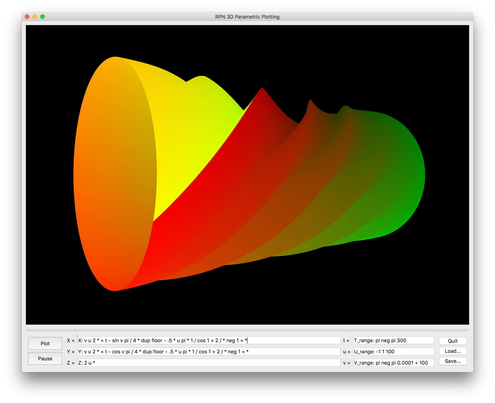

# RPN_3D_Plotter
This is 3D plotting program using OpenGL, C++, and Qt.

As with the RPN Calculator repository, the code here was only written for my own use, with no focus on collaboration with other coders. This compiles on my MacBook Pro. I don't know whether it would compile on other systems, or what it would take to make it compile.